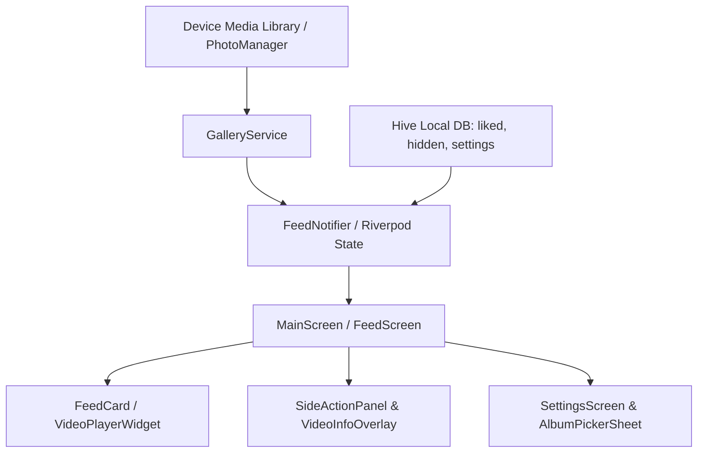

# Nostalgic Reel 🎬 (TikTok-Style Local Video Feed)

[](https://flutter.dev)
[](https://dart.dev)
[](https://riverpod.dev)
[](https://docs.hivedb.dev)
[](LICENSE)

**Nostalgic Reel** is a modern, high-performance Flutter mobile application that transforms local video files stored on a user's device into an immersive, vertical TikTok-style scrolling feed. It allows users to rediscover forgotten memories in their camera roll with sleek micro-animations, customizable playback modes, multi-album filtering, reactive like/hide management, and multi-language support.

---

## 💡 Executive Summary & Architecture Overview

The app is built following **Clean Architecture principles combined with Reactive State Management** powered by Flutter Riverpod. Media assets are retrieved from the native file system using `photo_manager`, persisted settings and states are handled locally with `hive_flutter`, and video decoding/playback is optimized with preloading via `video_player`.



---

## 📁 Directory Structure & File Map

```
lib/
├── core/
│   ├── constants/
│   │   └── app_constants.dart          # Hive box keys, playback modes, palette definitions, animation timings
│   ├── l10n/
│   │   └── app_localizations.dart      # Custom l10n delegate & translation keys (TR, EN, TK, RU)
│   └── theme/
│       └── app_theme.dart              # Dark glassmorphic design system, typography, dynamic accent colors
├── data/
│   ├── datasources/
│   │   └── local_preferences_datasource.dart # Direct Hive DB reader/writer abstraction
│   └── models/
│       └── video_item.dart             # Video model encapsulating AssetEntity, dimensions, duration & aspect ratio logic
├── providers/
│   └── feed_provider.dart              # Global Riverpod state providers (feed, likes, hides, albums, mode, locale, theme)
├── services/
│   └── gallery_service.dart            # Native photo_manager wrapper: asset fetching, pagination, sorting & thumbnails
├── screens/
│   ├── main_screen.dart                # Bottom Navigation wrapper (Feed, Favorites, Settings) & tab lifecycle sync
│   ├── permission_screen.dart          # Elegant permission request screen for storage/gallery access
│   ├── favorites/
│   │   └── favorites_screen.dart       # Grid/Feed view of user's liked videos
│   ├── feed/
│   │   └── feed_screen.dart            # Primary PageView feed with index tracking, preloading, and double-tap gestures
│   └── settings/
│       └── settings_screen.dart        # Full settings UI (Accent color, Fit mode, Mute default, Language, Hidden items)
└── widgets/
    ├── common/                         # Shared UI components
    └── feed/
        ├── album_picker_sheet.dart     # Bottom sheet for filtering feed by device albums/folders
        ├── feed_card.dart              # Video item container uniting player, overlays, and gesture detectors
        ├── playback_mode_selector.dart # Quick mode switcher overlay (Shuffle, Chronological Asc/Desc)
        ├── side_action_panel.dart      # Interactive vertical action bar (Like, Share, Hide, Info, Volume)
        ├── video_info_overlay.dart     # Video creation date, resolution, file name & duration display
        ├── video_player_widget.dart    # Lower-level VideoPlayer wrapper with auto-play/pause & aspect ratio fitting
        └── video_progress_bar.dart     # Custom scrubbable timeline progress indicator
```

---

## 🧠 Core State Management & Data Flow (Riverpod + Hive)

### 📦 Local Storage Boxes (`Hive`)
- **`liked_videos`** (`Box<bool>`): Key-value store mapping `video.id -> isLiked`.
- **`hidden_videos`** (`Box<bool>`): Key-value store mapping `video.id -> isHidden`.
- **`settings`** (`Box<dynamic>`): App settings including `playback_mode`, `mute_by_default`, `video_fit_cover`, `accent_color_index`, `selected_album_ids`, and `app_locale`.

### ⚡ Key Riverpod Providers (`lib/providers/feed_provider.dart`)
1. `feedProvider` (`StateNotifierProvider<FeedNotifier, FeedState>`): Manages current video list, pagination state (`currentPage`, `hasMore`), filtering, and sorting.
2. `likedIdsProvider` (`StateNotifierProvider<LikedIdsNotifier, Set<String>>`): Reactive set of liked video IDs synced with Hive.
3. `hiddenIdsProvider` (`StateNotifierProvider<HiddenIdsNotifier, Set<String>>`): Reactive set of hidden video IDs synced with Hive.
4. `selectedAlbumIdsProvider` (`StateNotifierProvider<SelectedAlbumNotifier, Set<String>>`): Active album filter IDs (empty set = all albums).
5. `playbackModeProvider` (`StateNotifierProvider<PlaybackModeNotifier, PlaybackMode>`): Active playback ordering (`shuffle`, `chronologicalAsc`, `chronologicalDesc`).
6. `videoFitModeProvider` (`StateNotifierProvider<VideoFitModeNotifier, int>`): Video scale mode (0 = Auto smart fit, 1 = Cover, 2 = Contain).
7. `accentColorIndexProvider` (`StateNotifierProvider<AccentColorNotifier, int>`): Active accent color index from `kAccentPalette`.
8. `appLocaleProvider` (`StateNotifierProvider<AppLocaleNotifier, Locale>`): Selected UI language (Turkish, English, Turkmen, Russian).
9. `isMutedProvider` (`StateProvider<bool>`): Global volume mute toggle across the feed.
10. `isFeedTabActiveProvider` (`StateProvider<bool>`): Controls whether the feed tab is visible, pausing video playback automatically when navigating to Favorites or Settings.

---

## 🔥 Key Technical Features & Implementation Details

### 1. Vertical TikTok-Style Video Feed (`PageView.builder`)
- **Preloading & Performance**: Videos are rendered using `PageView.builder`. Preloading logic (`AppConstants.preloadCount = 2`) warms up neighboring controllers while keeping memory usage minimal.
- **Smart Pause on Tab Switch**: `isFeedTabActiveProvider` monitors bottom nav tab switches and automatically pauses active playback when navigating away from the feed tab.

### 2. Intelligent Aspect Ratio & Video Fit Modes
- **Auto Mode (Default)**: Automatically determines format:
  - **Portrait Videos** (`aspectRatio < 1.0`): Rendered in `BoxFit.cover` for immersive full-screen display.
  - **Landscape Videos** (`aspectRatio >= 1.0`): Rendered in `BoxFit.contain` with sleek background blurring to prevent stretching or truncation.
- **Manual Overrides**: Options for forced `BoxFit.cover` or `BoxFit.contain` in Settings.

### 3. Playback Modes & Ordering Logic
- **`shuffle`**: Randomizes local video assets retrieved from `GalleryService`.
- **`chronologicalAsc`**: Sorts videos from oldest creation date to newest.
- **`chronologicalDesc`**: Sorts videos from newest to oldest.

### 4. Interactive Micro-Animations & Gestures
- **Double-Tap to Like**: Double-tapping the video screen triggers a heart pop animation (`flutter_animate`) with haptic feedback and adds the video to `likedIdsProvider`.
- **Custom Progress Scrubbing**: Interactive timeline slider allowing drag-scrubbing with immediate timestamp updates.

### 5. Multi-Language Support (`AppLocalizations`)
Built-in native localization supporting:
- 🇹🇷 **Turkish** (`tr`)
- 🇺🇸 **English** (`en`)
- 🇹🇲 **Turkmen** (`tk`)
- 🇷🇺 **Russian** (`ru`)

---

## 🤖 AI Agent Quick Context & Engineering Guidelines

> **Notice for AI Assistants & LLMs**: Read this section before making any code modifications!

1. **Working with `AssetEntity` vs `VideoItem`**:
   - `AssetEntity` originates from `photo_manager`. When restoring videos from persistent IDs (e.g. in Favorites), `item.asset` can be fetched asynchronously using `AssetEntity.fromId(id)`. Always check for potential nullability of `item.asset`.
2. **State Mutation Pattern**:
   - Do NOT modify Hive directly in widgets. Always invoke methods on Riverpod notifiers (`ref.read(likedIdsProvider.notifier).toggle(id)` or `ref.read(feedProvider.notifier).hideVideo(id)`).
3. **Video Controller Disposal**:
   - Controllers in `VideoPlayerWidget` are managed according to feed index position. Ensure `videoPlayerController.dispose()` is properly triggered during page transitions or widget unmounting to avoid memory leaks.
4. **Permissions Architecture**:
   - Permissions are validated on app startup in `main.dart` via `photo_manager`. If non-authorized, `PermissionScreen` is rendered. Overrides are passed into `ProviderScope` via `permissionGrantedProvider`.
5. **Adding New Settings / State**:
   - When adding a new setting:
     1. Add the key constant in `AppConstants`.
     2. Add getter/setter methods in `LocalPreferencesDatasource`.
     3. Expose a Riverpod `StateNotifierProvider` in `feed_provider.dart`.
     4. Add UI controls in `SettingsScreen` and l10n strings in `AppLocalizations`.

---

## 🛠️ Setup & Local Development

### Prerequisites
- **Flutter SDK**: `>=3.2.0 <4.0.0`
- **Dart SDK**: `^3.2.0`
- **Android Studio / Xcode** with emulator or real mobile device.

### 1. Clone & Install Dependencies
```bash
git clone https://github.com/Abdyrahmanp/gallerytiktok.git
cd gallerytiktok
flutter pub get
```

### 2. Generate Code (If needed for Hive/Riverpod)
```bash
flutter pub run build_runner build --delete-conflicting-outputs
```

### 3. Run Application
```bash
flutter run
```

---

## 📱 Platform Permissions Setup

### Android (`android/app/src/main/AndroidManifest.xml`)
```xml
<uses-permission android:name="android.permission.READ_EXTERNAL_STORAGE" android:maxSdkVersion="32" />
<uses-permission android:name="android.permission.READ_MEDIA_VIDEO" />
<uses-permission android:name="android.permission.READ_MEDIA_IMAGES" />
```

### iOS (`ios/Runner/Info.plist`)
```xml
<key>NSPhotoLibraryUsageDescription</key>
<string>We need access to your video gallery to display your local videos in a TikTok-style feed.</string>
```

---

## 📄 License
This project is licensed under the MIT License - see the `LICENSE` file for details.
